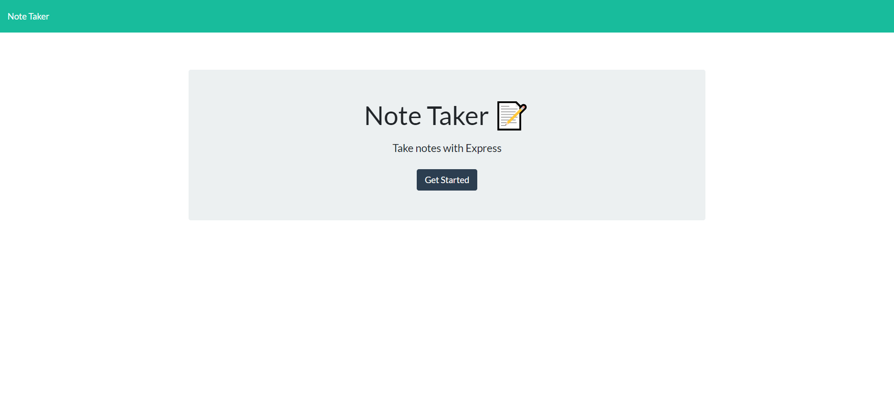

# The Keeper of my Notes

## Table of Contents

[Project Description](#description)

[Links](#links)

[Credits](#credits)
 
[Installation Guide](#installation-guide)

[Usage Iinformation](#usage-information)

[Contribution Guidelines](#contribution-guidelines)

[Testing Instructions](#testing-instructions)

[License Information](#license-information)

[Questions](#questions)

## Description

This is a basic note taker web application using NodeJs and Express. Notes are saved to JSON file for persistent storage.

## Links

[Github Repository](https://github.com/maggiemaywilder/noteKeeperApp)

[Heroku deployment](https://note-taker-app-mfw.herokuapp.com/notes)

## Credits
[Steve Griffith](https://www.youtube.com/channel/UCTBGXCJHORQjivtgtMsmkAQ) continues to be a reliable resource and one of the first places I turn for tutorials.

[Traversy Media](https://www.youtube.com/watch?v=L72fhGm1tfE) was also incredibly valuable for this project in helping set the basic foundations.

## Installation Guide

npm i

## Usage Information

node server.js to start

## Contribution Guidelines

Contact me by email or through my github if interested in contributing.

## Testing Instructions

n/a

## License Information

Notice: This application is covered under the MIT license.

 [License: MIT](https://opensource.org/licenses/MIT)

## Questions

If you have any questions, please feel free to reach out via one of the following avenues.

#### Contact info

[My GitHub](https://github.com/maggiemaywilder)

[My email](mailto:maggiemaywilder@gmail.com)

